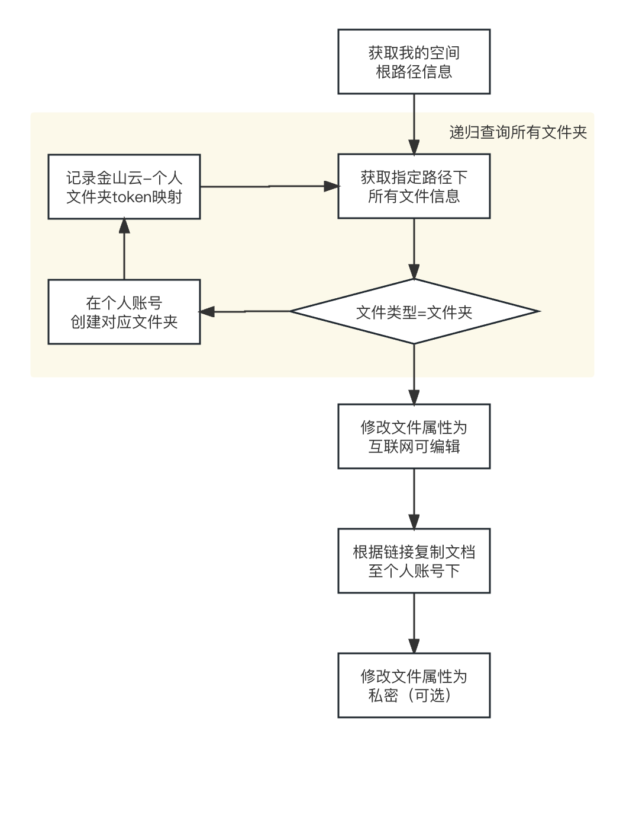
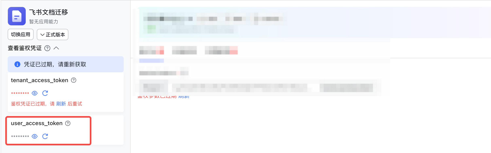
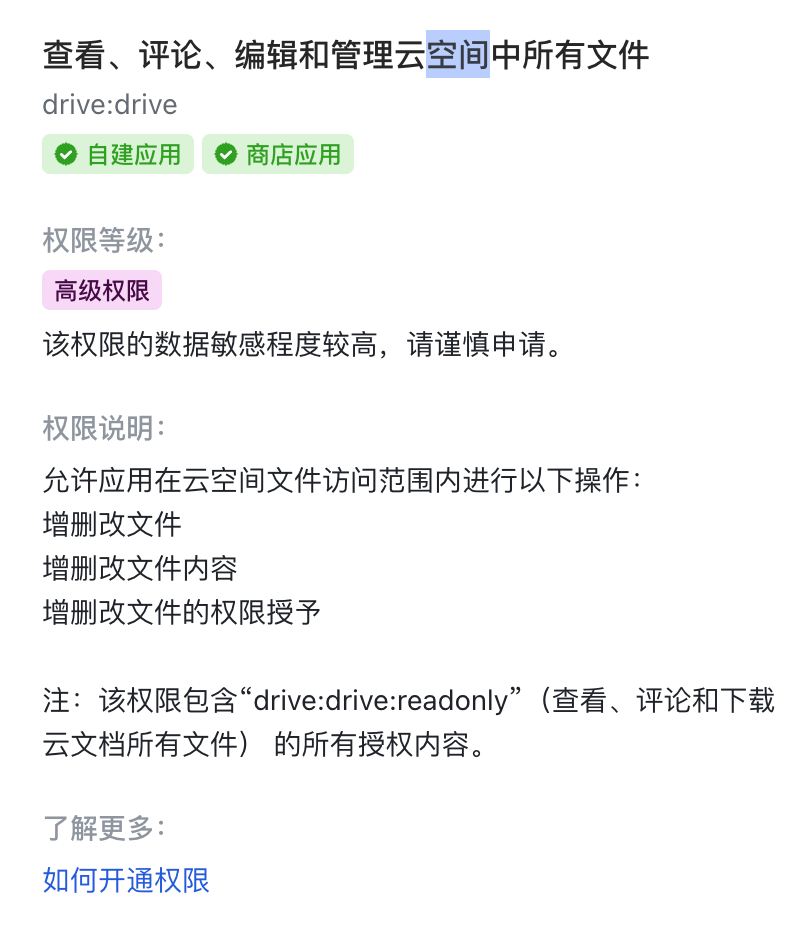

# 使用文档

## 工具简介：
本工具基于飞书pythonSDK开发，调用飞书5个API，实现了将金山云账号下，云文档-我的空间内所有文件复制至金山云个人账号下相同路径。
运行流程图如下所示：

使用的飞书接口如下：
1. 获取我的空间（root folder）元信息：读取我的空间元数据，核心是为了拿到根路径token  https://open.feishu.cn/document/server-docs/docs/drive-v1/folder/get-root-folder-meta
2. 获取文件夹下的清单：获取用户云空间中指定文件夹下的文件清单。清单类型包括文件、各种在线文档（文档、电子表格、多维表格、思维笔记）、文件夹和快捷方式。最大page_size设置为200，该接口支持分页，但是不会递归获取子文件夹的清单  https://open.feishu.cn/document/server-docs/docs/drive-v1/folder/list
3. 新建文件夹：在用户云空间的指定文件夹中创建一个新的空文件夹（该接口不支持并发创建，且调用频率上限为 5QPS 以及 10000次/天）  https://open.feishu.cn/document/server-docs/docs/drive-v1/folder/create_folder
4. 复制文件：将文件复制到用户云空间的其他文件夹中。不支持复制文件夹  https://open.feishu.cn/document/server-docs/docs/drive-v1/file/copy
5. 更新云文档权限设置：该接口用于根据 filetoken 更新云文档的权限设置  https://open.feishu.cn/document/server-docs/docs/permission/permission-public/patch-2

## 操作步骤：
### 1. 注册个人账号
此步骤忽略

### 2. 获取user_access_token
user_access_token相当于用户的登录鉴权凭证，用于后续的API调用。 访问凭证的具体获取方法可参考飞书官方文档：https://open.feishu.cn/document/server-docs/api-call-guide/calling-process/get-access-token

建议飞书开放平台创建一个企业应用，登陆后即可获取

注：需要分别获得个人账号、金山云账号的user_access_token

### 3. 权限开通
开通【查看、评论、编辑和管理云空间中所有文件】权限，可在上一步骤创建的企业应用中开通。

注：个人账号、金山云账号都需要开通上述权限

### 4. 执行脚本
安装相关依赖，在【[docmove.py](docmove.py)】中填入第二步获取的user_access_token_personal、user_access_token_ksyun即可完成开始执行迁移

## 注意事项：
1. 由于飞书部分接口不支持并发调取，或QPS限制<5。因此本工具采用单线程调用，速度较慢。平均速率约为1s钟完成一次文件操作动作，如文件复制、文件夹创建。可根据当前文件数量大概预估所需时间。
2. user_access_token有效期为2小时，超时后需要重新获取
3. 因开发时间有限，覆盖场景可能不充分。例如对于部分超时、异常中断、错误的重试机制。当发生错误时，可根据报错信息自行分析解决。
4. 如需要重新执行工具，建议删除已复制的文件，避免重复复制。
5. 原文档中如果引用了其他文档，无法修改引用关系为迁移后的新文档，需要自行处理。